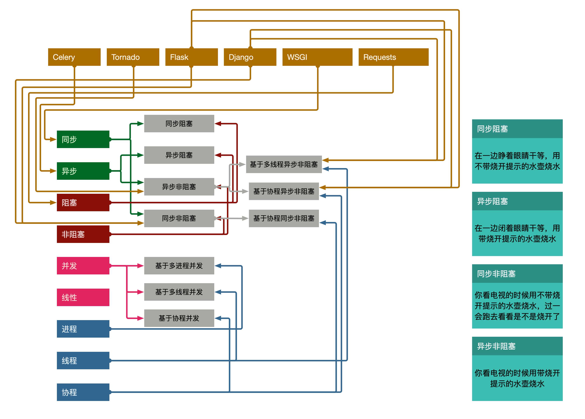
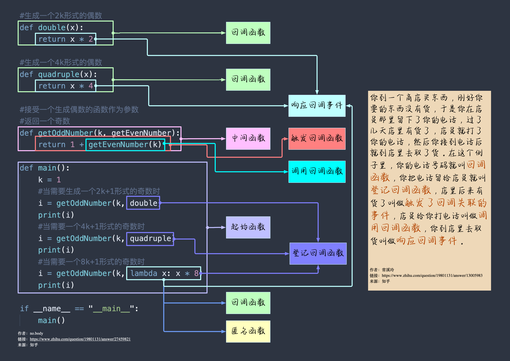

# my_mind_map
一些基于个人理解的思维导图

* [同步、异步、阻塞、非阻塞](./sync_async_blocking_nonblocking)

    

* [APM技术分类](./APM_classification)

    
    
    
    <img src="./wxapp_getwxacodeunlimit/小程序二维码生成服务流程图.png"

* watting for update..